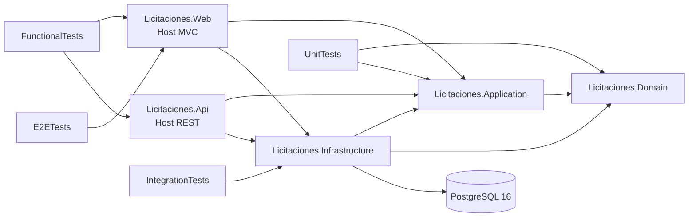
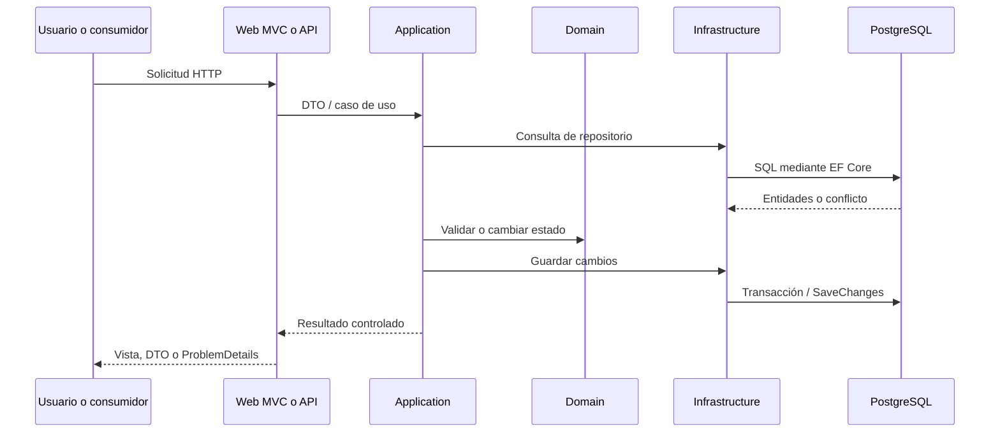

# Arquitectura general

## Propósito

La solución aplica separación modular y por capas para compartir reglas, casos de uso y persistencia entre una interfaz MVC y una API REST. No es un único ejecutable: Web y API son hosts independientes que usan la misma lógica y la misma base PostgreSQL.

## Solución .NET 9

`Licitaciones.sln` contiene cinco proyectos de producción y cuatro proyectos de pruebas, todos en `net9.0`. `global.json` fija el SDK `9.0.305` con avance al parche más reciente disponible.

```text
src/
  Licitaciones.Domain/
  Licitaciones.Application/
  Licitaciones.Infrastructure/
  Licitaciones.Web/
  Licitaciones.Api/
tests/
  Licitaciones.UnitTests/
  Licitaciones.IntegrationTests/
  Licitaciones.FunctionalTests/
  Licitaciones.E2ETests/
```

## Proyectos y responsabilidades

### Licitaciones.Domain

Contiene las reglas y tipos de negocio de proveedores, licitaciones, ofertas, evaluación de ofertas, niveles de aprobación y tipos de cambio. No referencia Application, Infrastructure, Web ni API.

### Licitaciones.Application

Coordina los casos de uso. Contiene servicios, DTO de solicitud/respuesta, objetos de resultado, consultas paginadas, interfaces de repositorios y la abstracción `IClock`. Depende únicamente de Domain.

### Licitaciones.Infrastructure

Implementa repositorios, `LicitacionesDbContext`, configuraciones Fluent API, migraciones, Npgsql, transacciones, convenciones de auditoría/concurrencia, reloj del sistema y health check opcional de PostgreSQL. Depende de Application y Domain.

### Licitaciones.Web

Host ASP.NET Core MVC con controladores, modelos de vista, Razor, Bootstrap, validación, cultura `es-CR` y cookies de tema/moneda. Consume Application e Infrastructure. En entornos distintos de `Testing` aplica migraciones al iniciar.

### Licitaciones.Api

Host ASP.NET Core Minimal API. Expone rutas `/api/v1`, ProblemDetails, correlación, health check y Swagger UI. Consume Application e Infrastructure. En entornos distintos de `Testing` también aplica migraciones al iniciar.

## Suites de pruebas

- `UnitTests`: dominio, servicios y una regla arquitectónica de independencia de Domain.
- `IntegrationTests`: PostgreSQL 16 mediante Testcontainers, migraciones, índices, restricciones, transacciones y concurrencia.
- `FunctionalTests`: Web/API iniciadas con `WebApplicationFactory` y PostgreSQL Testcontainers.
- `E2ETests`: navegador Chromium mediante Playwright, host Web real y PostgreSQL Testcontainers.

## Dependencias



Domain permanece independiente de EF Core y ASP.NET. Los hosts conocen Infrastructure para completar la composición de dependencias.

## Relación entre Web y API

Web y API no se llaman entre sí. Ambos:

1. registran los servicios de Application;
2. registran los repositorios y DbContext de Infrastructure;
3. ejecutan casos de uso sobre las mismas reglas de Domain;
4. acceden directamente a la misma base PostgreSQL mediante `ConnectionStrings:DefaultConnection`.

Esta separación permite publicar dos procesos, pero implica que ambos pueden ejecutar `Database.Migrate()` durante el arranque. No existe un migrador independiente; esa coordinación queda registrada como trabajo técnico futuro.

## Flujo general de datos



## Persistencia y despliegue

- PostgreSQL 16 es la fuente persistente.
- EF Core 9 y Npgsql implementan el mapeo.
- Docker Compose ejecuta PostgreSQL, Web y API.
- Kubernetes ejecuta dos Deployments y un StatefulSet PostgreSQL con PVC.
- Las imágenes de aplicación usan el nombre `v1.0.0-rc`; no existe tag Git equivalente.

## Limitaciones actuales

- La modularización es por capas, namespaces y carpetas, no por ensamblado independiente para cada módulo.
- Web y API aplican migraciones durante su arranque; no hay Job o proceso migrador único.
- El health check de API puede incluir PostgreSQL cuando se habilita; el de Web solo informa salud del proceso.
- La prueba arquitectónica solo protege la independencia de Domain, no todas las dependencias posibles.
- La landing y la vista MVC informativa de Swagger contienen texto antiguo; su corrección requiere modificar Web y queda fuera de Fase 9.
