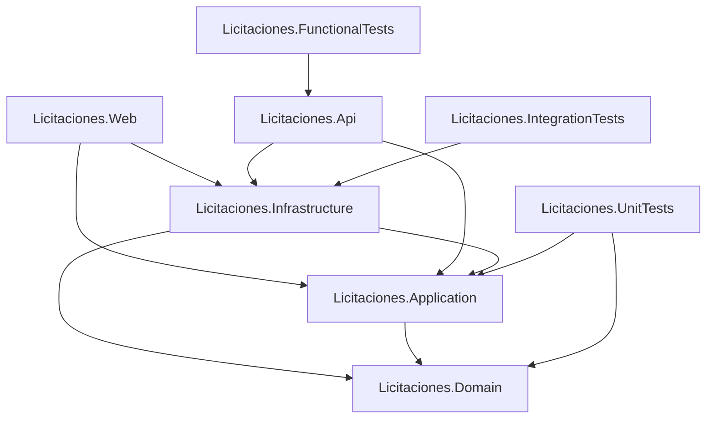

# Arquitectura general

## Propósito

Se eligió un monolito modular para mantener una sola solución desplegable, pero con separación clara de responsabilidades, límites de dependencia y una base ordenada para crecer por iteraciones sin mezclar capas técnicas con reglas de negocio.

## Estructura real

```text
Licitaciones.sln

src/
 Licitaciones.Domain/
 Licitaciones.Application/
 Licitaciones.Infrastructure/
 Licitaciones.Web/
 Licitaciones.Api/

tests/
 Licitaciones.UnitTests/
 Licitaciones.IntegrationTests/
 Licitaciones.FunctionalTests/
```

## Responsabilidad de los proyectos

- `Licitaciones.Domain`: reglas y conceptos centrales del dominio. No depende de otros proyectos de la solución.
- `Licitaciones.Application`: casos de uso, contratos y coordinación de operaciones. Depende de `Domain`.
- `Licitaciones.Infrastructure`: implementaciones técnicas futuras, persistencia e integración externa. Depende de `Application` y `Domain`.
- `Licitaciones.Web`: interfaz MVC. Depende de `Application` e `Infrastructure`.
- `Licitaciones.Api`: API REST. Depende de `Application` e `Infrastructure`.
- `Licitaciones.UnitTests`: pruebas unitarias y validaciones arquitectónicas.
- `Licitaciones.IntegrationTests`: pruebas técnicas y futuras pruebas con infraestructura real.
- `Licitaciones.FunctionalTests`: pruebas funcionales mediante el arranque real de la API con `WebApplicationFactory`.

No existen todavía casos de uso completos, repositorios, entidades de negocio ni persistencia real; esa implementación pertenece a fases posteriores.

## Dirección de dependencias

- `Application -> Domain`
- `Infrastructure -> Application, Domain`
- `Web -> Application, Infrastructure`
- `Api -> Application, Infrastructure`
- `UnitTests -> Domain, Application`
- `IntegrationTests -> Infrastructure`
- `FunctionalTests -> Api` mediante `WebApplicationFactory`

Estas dependencias mantienen a `Domain` independiente de `Infrastructure`, ASP.NET Core, Entity Framework Core, Web y API.

## Inyección de dependencias

Se prepararon métodos de extensión mínimos para la composición futura:

```csharp
builder.Services.AddApplication();
builder.Services.AddInfrastructure(builder.Configuration);
```

Por ahora no registran servicios de negocio ni repositorios, solo dejan la estructura lista para crecer sin acoplar capas.

## Health check

La API expone `GET /health` usando los health checks nativos de ASP.NET Core.

En esta fase el endpoint valida únicamente la disponibilidad básica de la API y responde con `200 OK` y el estado `Healthy`. Todavía no comprueba PostgreSQL, Docker ni servicios externos.

## Configuración común

La solución quedó configurada con:

- `TargetFramework` `net9.0`.
- `Nullable` habilitado.
- `ImplicitUsings` habilitado.
- Configuración común centralizada en `Directory.Build.props`.
- Reglas base de formato y análisis mantenidas en `.editorconfig`.

## Pruebas técnicas iniciales

Se agregaron tres validaciones técnicas mínimas:

- Prueba arquitectónica de independencia de `Domain`.
- Smoke test del ensamblado de `Infrastructure`.
- Prueba funcional de `GET /health`, que espera `200 OK` y contenido `Healthy`.

## Base de dominio de Fase 3

Se agregaron convenciones minimas para iniciar el desarrollo por TDD:

- `Entity<TId>` para entidades con identidad.
- `ValueObject` para objetos de valor con igualdad por componentes.
- `DomainException` para violaciones de invariantes del dominio.
- `ValidationError` y `ValidationResult` para validaciones acumulables.
- `Guard` para validaciones transversales pequenas.
- `IClock` en `Application` y `SystemClock` en `Infrastructure` para controlar dependencias de tiempo.

Estas piezas no implementan reglas especificas de historias futuras. Las reglas de proveedores, licitaciones, ofertas, aprobaciones y moneda quedan diferidas a sus iteraciones.

## Integración continua

El archivo `.github/workflows/ci.yml` ejecuta:

- Checkout del repositorio.
- Configuración de .NET 9.
- Restore.
- Build en `Release`.
- Test.

El workflow de GitHub Actions fue ejecutado correctamente y las validaciones de restore, build y test finalizaron exitosamente.

## Diagrama Mermaid



## Restricciones actuales

Todavía no se implementaron:

- CRUD.
- Entidades completas.
- Reglas de negocio.
- EF Core.
- PostgreSQL.
- Migraciones.
- Docker.
- Kubernetes.
- Módulos funcionales completos.

Esta documentación refleja solo la estructura técnica real preparada en la Fase 2.
La Fase 3 amplia esa base con convenciones minimas de dominio y pruebas TDD preparatorias.
