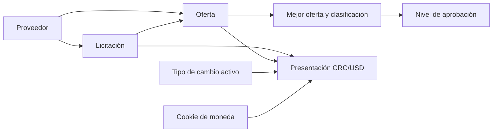

# Integración de módulos

## Flujo funcional actual

## Proveedor y licitación

Proveedor identifica a la organización oferente. Licitación define código, título, presupuesto CRC, fecha de cierre y estado. Ambos se recuperan desde repositorios antes de aceptar una oferta.

## Oferta

Una oferta relaciona una licitación y un proveedor mediante claves foráneas restrictivas. `OfertaService` comprueba existencia, borrado lógico, duplicidad y disponibilidad efectiva de la licitación. El monto debe ser positivo y no superar el presupuesto.

## Mejor oferta y aprobación

`EvaluadorOfertas` selecciona el menor monto y desempata por fecha de registro y UUID. Calcula ahorro, porcentaje y clasificación. El endpoint de mejor oferta consulta después `INivelAprobacionService` para incorporar el aprobador aplicable al monto ganador. No existe una pantalla MVC equivalente para mostrar el resultado integrado.

## Tipo de cambio y presentación monetaria

Los montos se persisten en CRC. `IMonedaConversionService` usa el tipo de cambio activo para calcular una representación USD. El parcial MVC `_MoneyDisplay` consulta la cookie `licitaciones.currency` y presenta CRC o USD junto con la fecha de la tasa. La conversión no modifica los valores persistidos.

## Preferencias de interfaz

- `licitaciones.currency`: `CRC` o `USD`.
- `licitaciones.theme`: `light` o `dark`.

Ambas cookies son esenciales, usan `SameSite=Lax` y vencen en un año. Las preferencias afectan presentación, no reglas de negocio.

## MVC y API

Web y API consumen los mismos servicios de Application. MVC transforma resultados en vistas y mensajes; API los transforma en DTO, códigos HTTP o ProblemDetails. No existe comunicación HTTP entre ambos hosts.

## Persistencia

Infrastructure conecta todos los módulos mediante un único `LicitacionesDbContext` y PostgreSQL. Las relaciones Oferta→Licitación y Oferta→Proveedor son las relaciones explícitas del modelo. Niveles de aprobación y tipos de cambio son catálogos independientes consultados por los casos de uso.

## Limitaciones actuales

- La integración mejor oferta→aprobador se presenta por API, no mediante una pantalla MVC.
- Ofertas, niveles de aprobación y tipos de cambio tienen paginación de backend, pero sus vistas no ofrecen navegación completa entre páginas.
- Web y API pueden intentar aplicar migraciones durante el arranque; no existe un migrador independiente.
