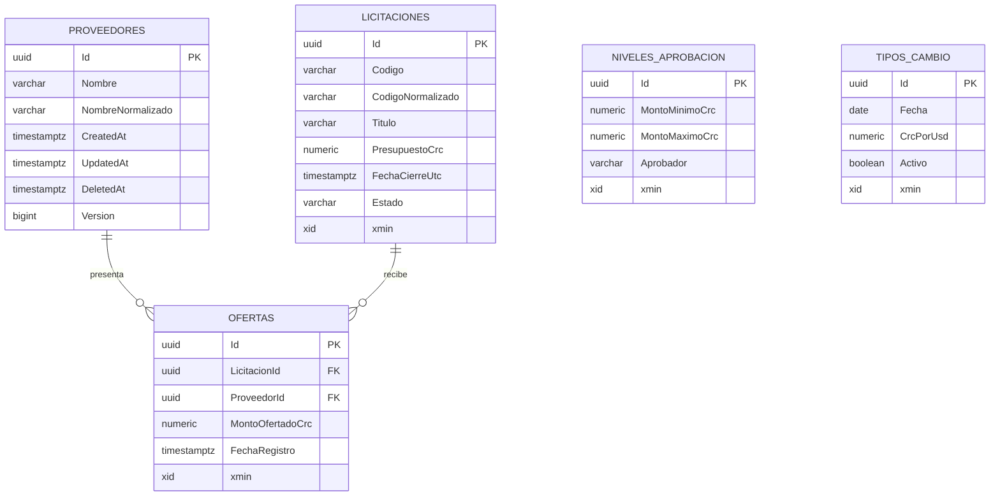

# Modelo de datos

## Estado actual

El modelo persistente de `main@36e89ec` usa PostgreSQL 16, Entity Framework Core 9 y Npgsql. Contiene cinco tablas de negocio y la tabla de historial de migraciones de EF Core.

## DbContext y estrategia EF Core

`LicitacionesDbContext` vive en Infrastructure y aplica configuraciones separadas mediante `ApplyConfigurationsFromAssembly`. Las convenciones comunes configuran:

- `CreatedAt`, `UpdatedAt` y `DeletedAt` como `timestamp with time zone` cuando existen;
- `Version` como token de concurrencia;
- montos con precisión `numeric(18,2)` mediante `HasMoneyPrecision()`.

La cadena se obtiene de `ConnectionStrings:DefaultConnection`. La fábrica de diseño usa por defecto PostgreSQL local en `localhost:55432` si no existe la variable `ConnectionStrings__DefaultConnection`.

## Diagrama relacional

Niveles de aprobación y tipos de cambio no tienen claves foráneas. Son catálogos consultados por Application.

## Tabla `Proveedores`

| Columna | Tipo | Regla |
|---|---|---|
| `Id` | `uuid` | PK, generado por Domain. |
| `Nombre` | `varchar(200)` | Requerido. |
| `NombreNormalizado` | `varchar(200)` | Requerido. |
| `CreatedAt` / `UpdatedAt` | `timestamptz` | Auditoría. |
| `DeletedAt` | `timestamptz NULL` | Borrado lógico. |
| `Version` | `bigint` | Token de concurrencia configurado por convención. |

`IX_Proveedores_NombreNormalizado` es único y parcial con filtro `DeletedAt IS NULL`. El query filter omite retirados. El nombre puede reutilizarse después del borrado lógico.

Limitación: los contratos de proveedores no exponen `Version` y el repositorio no traduce explícitamente conflictos concurrentes o carreras del índice único.

## Tabla `Licitaciones`

| Columna | Tipo | Regla |
|---|---|---|
| `Id` | `uuid` | PK. |
| `Codigo` | `varchar(50)` | Requerido. |
| `CodigoNormalizado` | `varchar(50)` | Requerido y único entre activos. |
| `Titulo` | `varchar(200)` | Requerido. |
| `PresupuestoCrc` | `numeric(18,2)` | Regla positiva en Domain. |
| `FechaCierreUtc` | `timestamptz` | Requerida. |
| `Estado` | `varchar(20)` | `Borrador`, `Publicada` o `Cerrada`. |
| Auditoría | `timestamptz` | `CreatedAt`, `UpdatedAt`, `PublishedAt`, `ClosedAt`, `DeletedAt`. |
| `xmin` | `xid` | Concurrencia optimista expuesta como `Version`. |

Índices:

- `IX_Licitaciones_CodigoNormalizado`: único parcial para registros sin `DeletedAt`.
- `IX_Licitaciones_Estado`.

Existe query filter para borrado lógico.

## Tabla `Ofertas`

| Columna | Tipo | Regla |
|---|---|---|
| `Id` | `uuid` | PK. |
| `LicitacionId` | `uuid` | FK restrictiva a `Licitaciones`. |
| `ProveedorId` | `uuid` | FK restrictiva a `Proveedores`. |
| `MontoOfertadoCrc` | `numeric(18,2)` | `CK_Ofertas_MontoPositivo`. |
| `FechaRegistro` / `UpdatedAt` | `timestamptz` | Registro y auditoría. |
| `xmin` | `xid` | Concurrencia optimista como `Version`. |

Índices:

- `IX_Ofertas_LicitacionId_ProveedorId`: único; una oferta por proveedor y licitación.
- `IX_Ofertas_ProveedorId`.

La oferta se elimina físicamente cuando la licitación todavía permite la operación.

## Tabla `NivelesAprobacion`

| Columna | Tipo | Regla |
|---|---|---|
| `Id` | `uuid` | PK. |
| `MontoMinimoCrc` | `numeric(18,2)` | `CK_NivelesAprobacion_MinimoPositivo`. |
| `MontoMaximoCrc` | `numeric(18,2) NULL` | `NULL` representa rango abierto. |
| `Aprobador` | `varchar(200)` | Requerido. |
| `CreatedAt` / `UpdatedAt` | `timestamptz` | Auditoría. |
| `xmin` | `xid` | Concurrencia optimista. |

Restricciones:

- `CK_NivelesAprobacion_MaximoValido`: máximo nulo o mayor/igual al mínimo.
- `IX_NivelesAprobacion_UnicoRangoAbierto`: índice único parcial con nulos no distintos.
- `EX_NivelesAprobacion_SinTraslapes`: exclusión GiST con `numrange(..., '[]')` para límites inclusivos.
- `IX_NivelesAprobacion_MontoMinimoCrc`.

## Tabla `TiposCambio`

| Columna | Tipo | Regla |
|---|---|---|
| `Id` | `uuid` | PK. |
| `Fecha` | `date` | Requerida; puede repetirse. |
| `CrcPorUsd` | `numeric(18,2)` | `CK_TiposCambio_CrcPorUsdPositivo`. |
| `Activo` | `boolean` | Solo uno puede ser verdadero. |
| `CreatedAt` / `UpdatedAt` | `timestamptz` | Auditoría. |
| `xmin` | `xid` | Concurrencia optimista. |

Índices:

- `IX_TiposCambio_Fecha`: no único.
- `IX_TiposCambio_UnicoActivo`: único parcial con filtro `Activo = TRUE`.

La activación desactiva el registro activo anterior y guarda el nuevo dentro de una transacción controlada por `TipoCambioRepository`.

## Migraciones

El modelo actual tiene seis migraciones, en este orden:

1. `20260810092133_CreateProveedores`
2. `20260811234653_MakeProveedorNameUniqueIndexPartial`
3. `20260812002104_CreateLicitaciones`
4. `20260813011055_Iteration03OfertasAprobacion`
5. `20260813205016_Iteration04TiposCambio`
6. `20260814014136_AllowDuplicateTipoCambioDates`

## Ejecución de migraciones

Web y API llaman `Database.Migrate()` durante el arranque fuera del entorno `Testing`. Docker y Kubernetes no contienen un migrador independiente. Dos hosts pueden intentar aplicar migraciones al mismo tiempo; el estado se documenta aquí, sin corregirlo durante Fase 9.

## Persistencia y pruebas

Las pruebas de integración usan PostgreSQL 16 real mediante Testcontainers. Cubren migraciones, restricciones, índices, relaciones, filtros, concurrencia y transacciones. Los resultados numéricos registrados pertenecen a evidencia histórica y se detallan en [pruebas.md](pruebas.md).
